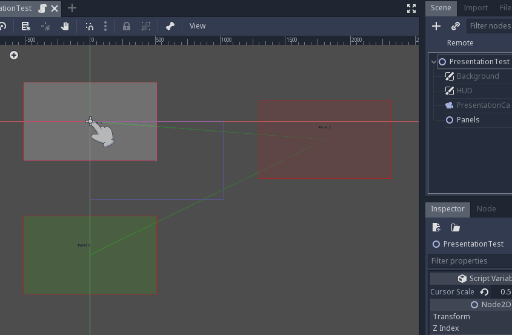

# Godozzi (godottsi/ゴドッツィ)

Simple presentation tool simitar to *prezi* (infinite space based).

## How to use

This presentation tool is panel based, each "slide" is a custom 2D panel (see [Panel.tscn](tools/Panel.tscn)).
You can create each panel independently, then instance them in the order of presentation in another scene with a "Panels" root (see [Panels.tscn](tools/Panels.tscn)).
Now create a new Presentation scene (see [Presentation.tscn](tools/Presentation.tscn)) and instance your Panels root.

## Keymaps

|Navigation commands| Keyboard/Mouse                  | Controller                         |
|:-----------------:|:-------------------------------:|:----------------------------------:|
| next              |           <kbd>→</kbd>          | <kbd>A</kbd> or D-pad <kbd>→</kbd> |
| previous          | <kbd>←</kbd>                    | <kbd>B</kbd> or D-pad <kbd>←</kbd> |
| toggle fullscreen | <kbd>F11</kbd>                  |  <kbd>Y</kbd> or Right Stick Click |
| zoom in           | <kbd>=/+</kbd>                  | <kbd>Start</kbd>                   |
| zoom out          | <kbd>-</kbd>                    | <kbd>Select</kbd>                  |
| camera move       | <kbd>WASD</kbd>                 | Right Stick                        |
| cursor move       | <kbd>IJKL</kbd> or Mouse motion | Left Stick                         |
| toggle cursor     | Mouse middle Click              | Left Stick Click                   |

## Customization

There are some per-Panel customizations such as camera zoom (default to 1.0) and background color (default to white).

## Sample Presentation

[PresentationTest.tscn](devel/PresentationTest.tscn)

